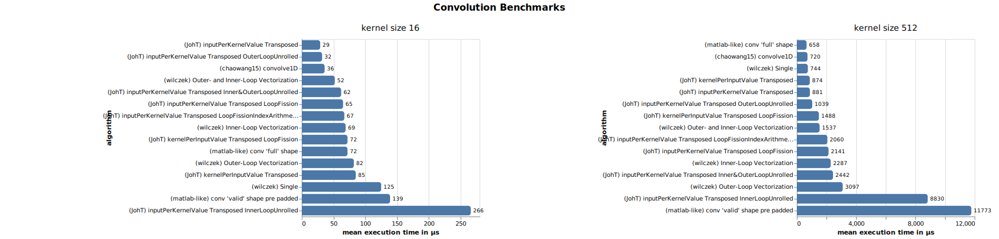
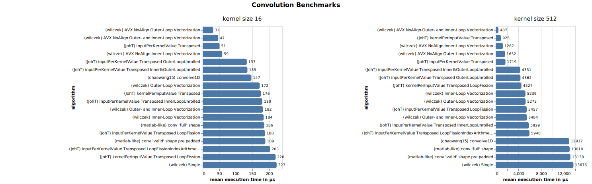
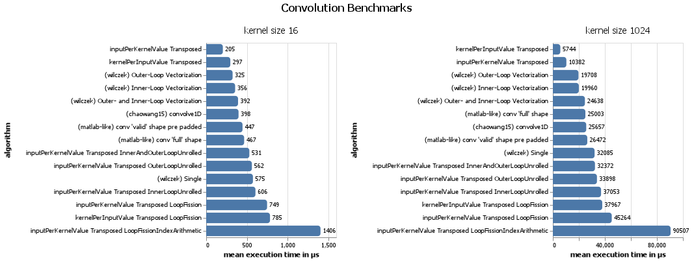

# Benchmark Charts

## MacOS on Intel with AVX compiled with [CLang](https://clang.llvm.org) 

## MacOS on M1 with Neon compiled with [CLang](https://clang.llvm.org) 

## Windows on Intel with SSE (no AVX) compiled with [Microsoft Visual C++ (MSVC)](https://visualstudio.microsoft.com/de/vs/features/cplusplus)

## Windows on Intel with AVX compiled with [Microsoft Visual C++ (MSVC)](https://visualstudio.microsoft.com/de/vs/features/cplusplus)

## Windows on Intel with AVX2 compiled with [Microsoft Visual C++ (MSVC)](https://visualstudio.microsoft.com/de/vs/features/cplusplus)

## Floating Point compile options

### [Microsoft Visual C++ (MSVC)](https://visualstudio.microsoft.com/de/vs/features/cplusplus) with `/fp:precise` (default)

### [Microsoft Visual C++ (MSVC)](https://visualstudio.microsoft.com/de/vs/features/cplusplus) with `/fp:fast`
