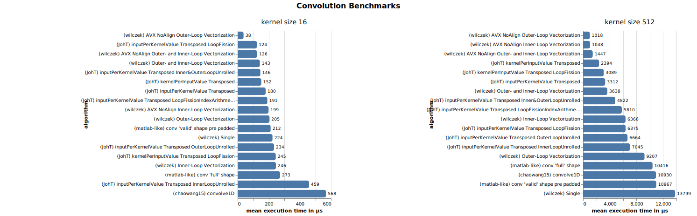
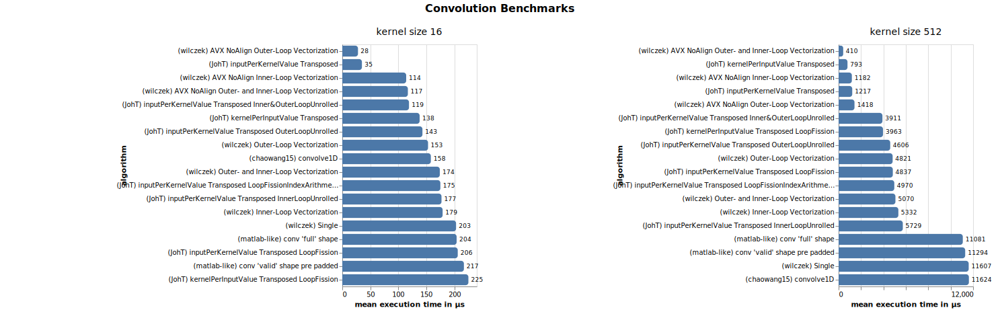
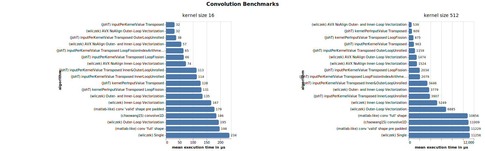
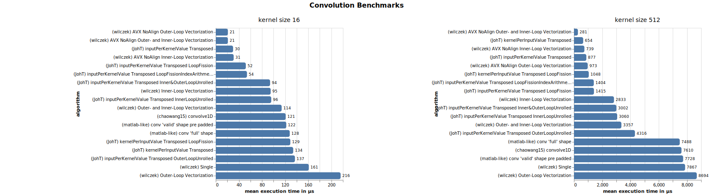
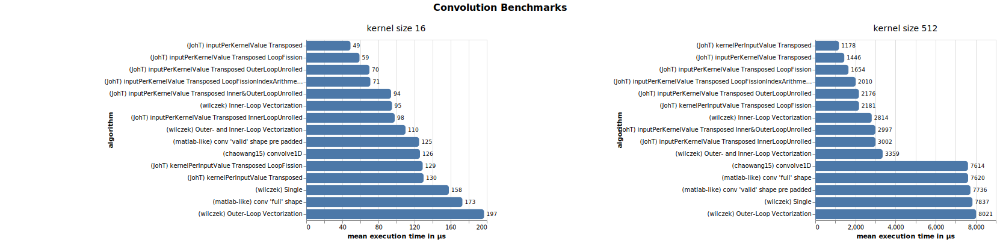

# Convolution Benchmark Charts

The following charts show the mean execution time of different convolution implementations on different systems.
The absolute numbers vary vastly between systems and even on two consecutive runs of the same system. This might also affect the ranking. Thus these charts are intended to only give an overview and support fast-feedback development.

Also note that for now (2022), all implementations are based on the classical algorithm (no FFT, no Winograd) for rather small (16) and medium (512) sized kernels. 

Nevertheless, there are some significant differences that can be derived from the charts:
- Manual optimization using [intrinsics](https://docs.microsoft.com/en-us/cpp/intrinsics/compiler-intrinsics?view=msvc-170) is likely to be faster than auto vectorization of the compiler especially for the targeted system.
- Auto vectorization of the compiler can come close to or even outperform manual optimization, if the latter was written for CPU features that aren't available on the target system or if there are more modern features available that are utilized by the compiler. The resulting code is also much easier to read and maintain.
- Implementations that can't be vectorized by the compiler are likely to be slower than implementations that can. Having an eye on the vectorization reports is a good way to find out if the compiler is vectorizing the code or not.
- The "FIR Direct Form Transposed" (L. Wanhammar, DSP Integrated Circuits, 1999) structure is likely to be faster than the classic "FIR Direct Form". Even if they are both mathematically identical, "FIR Direct Form Transposed" seems to benefit more from optimizations. Especially because it can be written without branches (if-Statements).
- Iterating over the significant smaller part of the convolution (in most cases the kernel) in the outer loop is likely to be faster than iterating over the input values. This leads to more multiplications with the same value in a row which is more cache friendly. So "inputPerKernelValueTransposed" in [JohTConvolution.h](./../source/JohTConvolution.h) is usually faster than "kernelPerInputValueTransposed". For bigger kernels, the difference is smaller.

## MacOS
### MacOS on arm64 with Neon compiled with Apple[CLang](https://clang.llvm.org)

### MacOS on Intel with AVX compiled with Apple[CLang](https://clang.llvm.org) 

## Windows

### Windows on Intel with AVX512 compiled with [MSVC](https://visualstudio.microsoft.com/de/vs/features/cplusplus)

### Windows on Intel with AVX2 compiled with [MSVC](https://visualstudio.microsoft.com/de/vs/features/cplusplus)

### Windows on Intel with AVX compiled with [MSVC](https://visualstudio.microsoft.com/de/vs/features/cplusplus)

## Linux

### Ubuntu Linux on Intel with AVX512 compiled with [GCC](https://gcc.gnu.org)

### Ubuntu Linux on Intel with AVX2 compiled with [GCC](https://gcc.gnu.org)

### Ubuntu Linux on Intel with AVX compiled with [GCC](https://gcc.gnu.org)

### Ubuntu Linux on Intel with SSE2 compiled with [GCC](https://gcc.gnu.org)

## Floating Point compile options (manual)

### [Microsoft Visual C++ (MSVC)](https://visualstudio.microsoft.com/de/vs/features/cplusplus) with `/fp:precise` (default)

### [Microsoft Visual C++ (MSVC)](https://visualstudio.microsoft.com/de/vs/features/cplusplus) with `/fp:fast`
